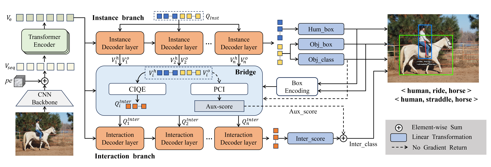

# CMFN: instructive queries and consistent predictions for human-object interaction detection
Code for our paper "[CMFN: instructive queries and consistent predictions for human-object interaction detection]()".

Contributed by Wei Yan, [Xue-song Tang*](https://web.dhu.edu.cn/cist/2016/0428/c20585a145693/page.htm), Yubing Li, Kuangrong Hao, and Zhiqi Wang.



## Installation
Installl the dependencies.
```
pip install -r requirements.txt
```
## Data preparation

### HICO-DET
HICO-DET dataset can be downloaded [here](https://drive.google.com/open?id=1QZcJmGVlF9f4h-XLWe9Gkmnmj2z1gSnk). After finishing downloading, unpack the tarball (`hico_20160224_det.tar.gz`) to the `data` directory.

Instead of using the original annotations files, we use the annotation files provided by the PPDM authors. The annotation files can be downloaded from [here](https://drive.google.com/open?id=1WI-gsNLS-t0Kh8TVki1wXqc3y2Ow1f2R). The downloaded annotation files have to be placed as follows.
```
data
 └─ hico_20160224_det
     |─ annotations
     |   |─ trainval_hico.json
     |   |─ test_hico.json
     |   └─ corre_hico.npy
     :
     ─ data
     |   |─ num_hoi_hico.pkl
     :
```

### V-COCO
First clone the repository of V-COCO from [here](https://github.com/s-gupta/v-coco), and then follow the instruction to generate the file `instances_vcoco_all_2014.json`. Next, download the prior file `prior.pickle` from [here](https://drive.google.com/drive/folders/10uuzvMUCVVv95-xAZg5KS94QXm7QXZW4). Place the files and make directories as follows.
```
CMFN
 |─ data
 │   └─ v-coco
 |       |─ data
 |       |   |─ instances_vcoco_all_2014.json
 |       |   |─ num_hoi_vcoco.pkl
 |       |   :
 |       |─ prior.pickle
 |       |─ images
 |       |   |─ train2014
 |       |   |   |─ COCO_train2014_000000000009.jpg
 |       |   |   :
 |       |   └─ val2014
 |       |       |─ COCO_val2014_000000000042.jpg
 |       |       :
 |       |─ annotations
 :       :
```
For our implementation, the annotation file have to be converted to the HOIA format. The conversion can be conducted as follows.
```
PYTHONPATH=data/v-coco \
        python convert_vcoco_annotations.py \
        --load_path data/v-coco/data \
        --prior_path data/v-coco/prior.pickle \
        --save_path data/v-coco/annotations
```
Note that only Python2 can be used for this conversion because `vsrl_utils.py` in the v-coco repository shows a error with Python3.

V-COCO annotations with the HOIA format, `corre_vcoco.npy`, `test_vcoco.json`, and `trainval_vcoco.json` will be generated to `annotations` directory.


## Pre-trained model
Download the pretrained model of DETR detector for [ResNet50](https://dl.fbaipublicfiles.com/detr/detr-r50-e632da11.pth), and put it to the `params` directory.
```
python ./tools/convert_parameters.py \
        --load_path params/detr-r50-e632da11.pth \
        --save_path params/detr-r50-pre-2branch-hico.pth \
        --num_queries 64

python ./tools/convert_parameters.py \
        --load_path params/detr-r50-e632da11.pth \
        --save_path params/detr-r50-pre-2branch-vcoco.pth \
        --dataset vcoco \
        --num_queries 64
```

## Training
After the preparation, you can start training with the following commands.
### HICO-DET
```
sh ./config/hico_s.sh
```

### V-COCO
```
sh ./configs/vcoco_s.sh
```
### Zero-shot
```
sh ./configs/hico_s_zs_nf_uo.sh
```

## Evaluation

### HICO-DET
You can conduct the evaluation with trained parameters for HICO-DET as follows.
```
sh ./configs/eval_hico.sh
```

For the official evaluation (reported in paper), you need to covert the prediction file to a official prediction format following [this file](./tools/covert_annot_for_official_eval.py), and then follow [PPDM](https://github.com/YueLiao/PPDM) evaluation steps.
### V-COCO
You can conduct the evaluation with trained parameters for HICO-DET as follows.
```
python generate_vcoco_official.py --aux_weight=0.
```

### Zero-shot
```
sh ./configs/hico_s_zs_uo.sh
```

## Regular HOI Detection Results

### HICO-DET
|                    | Full (D) |Rare (D)|Non-rare (D)|Full(KO)|Rare (KO)|Non-rare (KO)|Download| Conifg|
|:-------------------|:--------:| :---: | :---: | :---: |:-------:|:-----------:| :---: | :---: |
| CMFN-S (R50)   |  33.74   | 27.69 |35.57 | 36.82|  31.34  |    38.46    | [model](https://pan.baidu.com/s/1s-KqUpN9pAlz1KpXoCX0vg) | [config](./configs/hico_s.sh)|
| CMFN-M (R101) |  35.06   | 30.78|  36.34|  38.06|  34.20  |  39.21 | [model](https://pan.baidu.com/s/1S9LpblfcvmLU_vVQWsOH2g) |[config](./configs/hico_s.sh)|

D: Default, KO: Known object.


### V-COCO
| | Scenario 1 | Scenario 2 | Download | Config | 
| :--- | :---: | :---: | :---: | :---: |
|CMFN-S (R50)| 64.2| 66.7 | [model](https://pan.baidu.com/s/1hmz7s3mAxg2-oios-JT-7g) |[config](./configs/vcoco_s.sh) |
|CMFN-M (R101)| 65.6 |67.9 | [model](https://pan.baidu.com/s/1K-tyOgGsJoOmKeIQQMw8ng) |[config](./configs/vcoco_l.sh) |


## License
CMFN is released under the MIT license. See [LICENSE](./LICENSE) for additional details.

## Acknowledge
Some of the codes are built upon [Gen-vlkt](https://github.com/YueLiao/gen-vlkt), [DETR](https://github.com/facebookresearch/detr), and [PVIC](https://github.com/fredzzhang/pvic). Thanks them for their great works!

